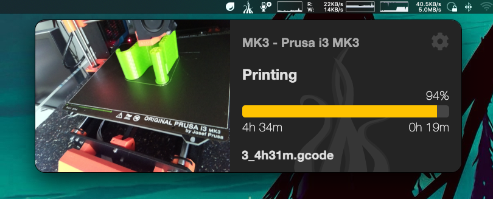

# OctoTray

    

## About

A MenuBar (TrayBar) application, which is designed to work with an
[OctoPrint](https://octoprint.org/) server in order to easily access the
current state of the system as well as ongoing prints.

## Supported Systems

Currently there is only a macOS build available, as this is the only one I need
and can easily test. Nevertheless, as this is an Electron based application,
it can most likely build it for other systems as well. If you have a need for
that, either send me a pull request, which is always welcome, or drop me
a line, if you can't do this yourself.
